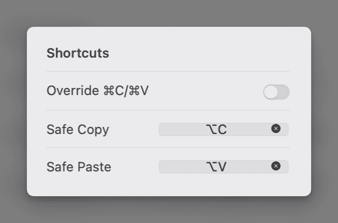
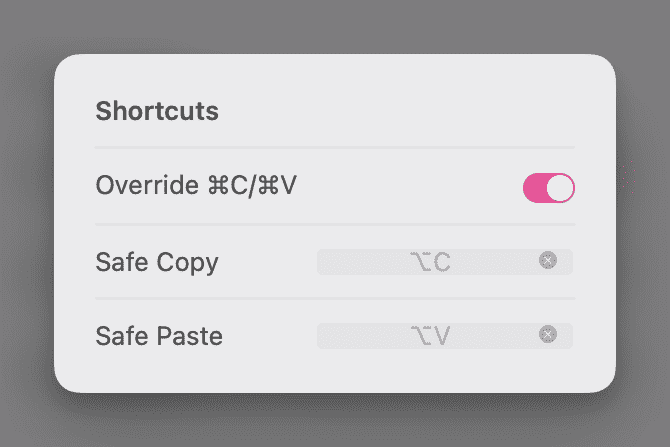

    

# Copi
**A Secure Clipboard Alternative for macOS**

**English** · [简体中文](./README.zh-CN.md)

<!-- SHIELD GROUP -->
  

[Copi](https://copi.cleanclip.cc) is an open-source, lightweight, and secure clipboard alternative for macOS. It offers the same copy and paste functionality as the system clipboard, but its contents cannot be accessed by any third-party applications, effectively protecting your privacy data.

## Why Copi?

1. Defend against clipboard hijacking attacks
2. Prevent clipboard content leakage

## Who Needs It?

If you:
1. Own digital currencies
2. Frequently copy sensitive information
3. Don't trust the system clipboard

## How to Use?

### 1. Action Bar Mode
Once the Action Bar is enabled, when you select text, quick buttons for secure copying and pasting will appear above the selected text. Click with the mouse to use Copi's clipboard for text operations. Long-press text input fields to show the paste option.

### 2. Shortcut Mode
You can set dedicated shortcuts for secure copying and pasting.

### 3. Override System Copy and Paste Shortcuts
After overriding, all text copying and pasting will automatically go through Copi's secure channels.

## Why Trust You?
Open source.

## How to Ensure Data Security?

Use the system's custom "service" feature to get and paste text, instead of going through the system clipboard. Therefore, various attacks targeting the "system clipboard" using traditional methods will all fail.

## Roadmap
- [x] Stealth Copy
- [x] Action Bar
- [x] Dedicated Copy Shortcut
- [x] Override System Copy and Paste Shortcuts
- [ ] Automatic Obfuscated Paste
    - [ ] Predefined Regex
    - [ ] User-defined Regex
    - [ ] User-defined Fixed String
    - [ ] From Password Manager

## Download
https://github.com/s1ntoneli/Copi/releases

## Screenshots

## Share with More People 🔥

[![][share-x-shield]][share-x-link]&nbsp;
[![][share-facebook-shield]][share-facebook-link]&nbsp;
[![][share-telegram-shield]][share-telegram-link]&nbsp;
[![][share-whatsapp-shield]][share-whatsapp-link]&nbsp;
[![][share-reddit-shield]][share-reddit-link]&nbsp;
[![][share-linkedin-shield]][share-linkedin-link]

<!-- [![][share-weibo-shield]][share-weibo-link]  -->
<!-- [![][share-mastodon-shield]][share-mastodon-link]  -->

## Contributing

Contributions are welcome! 👏

For major changes, please open an issue first to discuss what you would like to change.

Please make sure to update tests as appropriate.

## License

[MIT](./LICENSE)

[share-x-link]: https://twitter.com/intent/tweet?url=https%3A%2F%2Fcopi.cleanclip.cc&text=Copi%20-%20An%20open%20source%20secure%20alternatives%20to%20the%20macOS%20system%20clipboard.%20Protect%20your%20data%20a%20step%20ahead%2C%20no%20more%20worries%20about%20clipboard%20data%20leakage
[share-x-shield]: https://img.shields.io/badge/-share%20on%20x-black?labelColor=black&logo=x&logoColor=white
[share-facebook-link]: https://www.facebook.com/sharer/sharer.php?u=https%3A%2F%2Fcopi.cleanclip.cc%20Protect%20your%20data%20a%20step%20ahead%2C%20no%20more%20worries%20about%20clipboard%20data%20leakage.
[share-facebook-shield]: https://img.shields.io/badge/-share%20on%20facebook-black?labelColor=black&logo=facebook&logoColor=white
[share-linkedin-link]: http://www.linkedin.com/shareArticle?mini=true&url=https%3A%2F%2Fcopi.cleanclip.cc&title=Copi%20-%20An%20open%20source%20secure%20alternatives%20to%20the%20macOS%20system%20clipboard.%20Protect%20your%20data%20a%20step%20ahead%2C%20no%20more%20worries%20about%20clipboard%20data%20leakage
[share-linkedin-shield]: https://img.shields.io/badge/-share%20on%20linkedin-black?labelColor=black&logo=linkedin&logoColor=white

<!-- [share-mastodon-link]:
[share-mastodon-shield]: https://img.shields.io/badge/-share%20on%20mastodon-black?labelColor=black&logo=mastodon&logoColor=white&style=flat-square -->

[share-reddit-link]: http://www.reddit.com/submit?url=https%3A%2F%2Fcopi.cleanclip.cc&title=Copi%20-%20An%20open%20source%20secure%20alternatives%20to%20the%20macOS%20system%20clipboard.%20Protect%20your%20data%20a%20step%20ahead%2C%20no%20more%20worries%20about%20clipboard%20data%20leakage
[share-reddit-shield]: https://img.shields.io/badge/-share%20on%20reddit-black?labelColor=black&logo=reddit&logoColor=white
[share-telegram-link]: https://t.me/share/url?url=https://copi.cleanclip.cc&text=Copi%20-%20An%20open%20source%20secure%20alternatives%20to%20the%20macOS%20system%20clipboard.%20Protect%20your%20data%20a%20step%20ahead%2C%20no%20more%20worries%20about%20clipboard%20data%20leakage.
[share-telegram-shield]: https://img.shields.io/badge/-share%20on%20telegram-black?labelColor=black&logo=telegram&logoColor=white

<!-- [share-weibo-link]:
[share-weibo-shield]: https://img.shields.io/badge/-share%20on%20weibo-black?labelColor=black&logo=sinaweibo&logoColor=white&style=flat-square -->

[share-whatsapp-link]: https://api.whatsapp.com/send?text=https://copi.cleanclip.cc
[share-whatsapp-shield]: https://img.shields.io/badge/-share%20on%20whatsapp-black?labelColor=black&logo=whatsapp&logoColor=white
